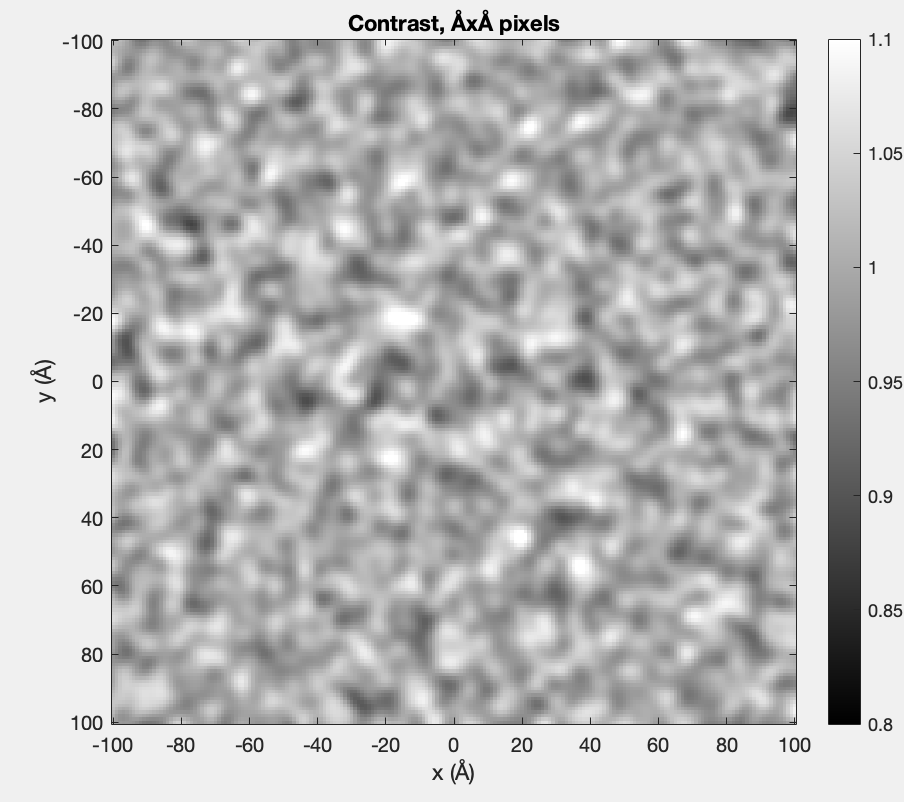

# cryoEM_simulations
MATLAB Simulations to explore RNA CryoEM 

## Basic example

In MATLAB, make sure to add `scripts/` and subdirectories to your path (with `Set Path`)

Then 

```
% Read in example PDB
pdbstruct = pdbread( 'example/helix_40bp.pdb');
pdbstruct = center_pdb( pdbstruct );
pdbstruct = rotate_pdb( pdbstruct, rotationVectorToMatrix([0,pi/2,0]) );

defocus = -1; % in nm
sigma_blur = 2; % Gaussian blur to apply to image, in Å
max_x = 100; % bounds of x and y, in Å. (box will be +/- max_x)
ice_thickness = 20; % ice thickness, in nm
[intensity,amplitude,pixels] = simulate_map_from_pdb_FFTbased( pdbstruct, defocus, sigma_blur, max_x, ice_thickness );

```

Output should look like:



## What's in here
- `scripts/` has the scripts.
- `notes/` compiles a bunch of notes on exploratory exercises
- `tests/` has tests that go with the exercises


